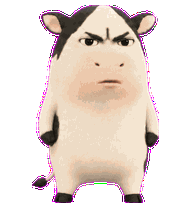
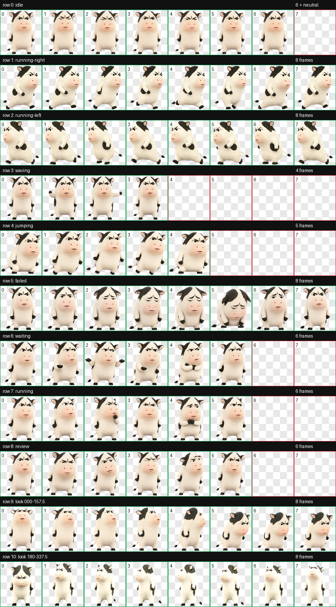

# 哼哼牛 · Hengheng Cow

一只丧丧的、笨拙又不服气的黑白奶牛桌面宠物，拖着小尾巴陪你工作。



## 安装到 Codex Desktop

### 方法一：Git 克隆

```bash
git clone https://github.com/FeiFei-AIDev/hengheng-cow.git ~/.codex/pets/hengheng-cow
```

### 方法二：只下载宠物文件

```bash
mkdir -p ~/.codex/pets/hengheng-cow
curl -L https://raw.githubusercontent.com/yunfeili9363/hengheng-cow/main/pet.json \
  -o ~/.codex/pets/hengheng-cow/pet.json
curl -L https://raw.githubusercontent.com/yunfeili9363/hengheng-cow/main/spritesheet.webp \
  -o ~/.codex/pets/hengheng-cow/spritesheet.webp
```

安装完成后，打开 Codex Desktop：

1. 进入 **Settings → Appearance → Pets**。
2. 在自定义宠物中选择 **哼哼牛**。
3. 点击 **Select**，或在 Codex 中使用 `/pet` 唤醒它。

## Install in Codex Desktop

Clone this repository into your Codex pets folder:

```bash
git clone https://github.com/FeiFei-AIDev/hengheng-cow.git ~/.codex/pets/hengheng-cow
```

Then open **Settings → Appearance → Pets**, select **哼哼牛**, and click **Select**.

## 文件

- `pet.json` — Codex 宠物元数据
- `spritesheet.webp` — Codex v2 动画图集（8×11，192×208 单元格）
- `preview.gif` — 待机动画预览
- `contact-sheet.png` — 完整动作预览



## Fan-art notice

This is an unofficial, fan-made desktop-pet adaptation inspired by a widely circulated internet meme image. It is not affiliated with or endorsed by the original character or image rightsholders. Rights in the underlying reference material remain with their respective owners.

该项目是基于网络流传梗图制作的非官方同人桌面宠物，与原始形象或图片权利人无隶属或授权关系。原始参考素材的相关权利归各自权利人所有。如权利人认为本项目侵犯其权益，请提交 Issue 联系删除或调整。

No open-source license is granted for commercial reuse of the character artwork.
